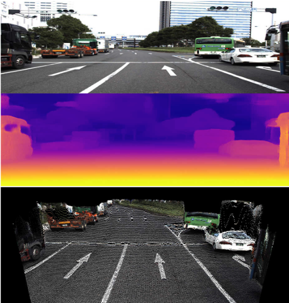
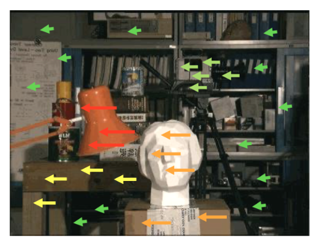
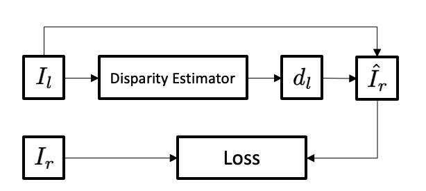
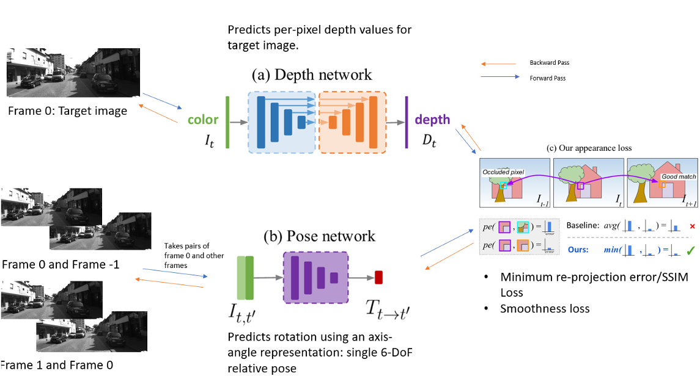
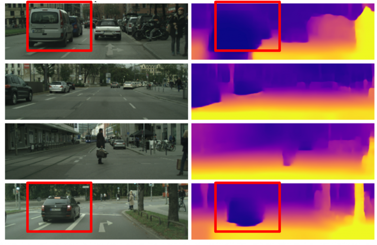
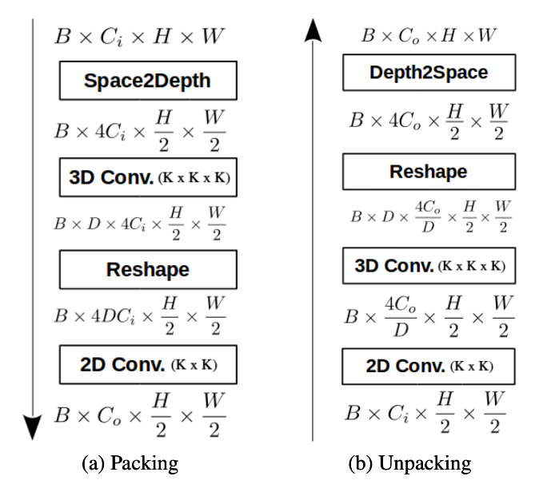
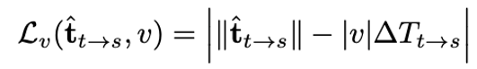
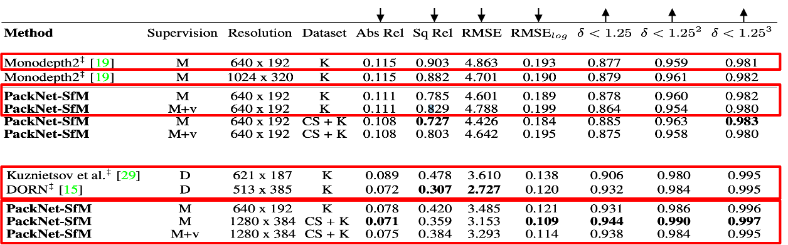
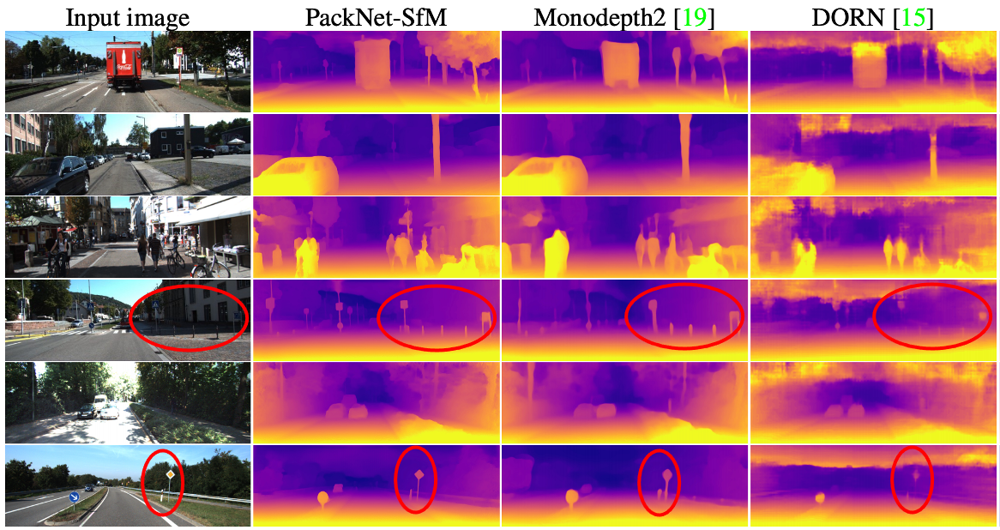
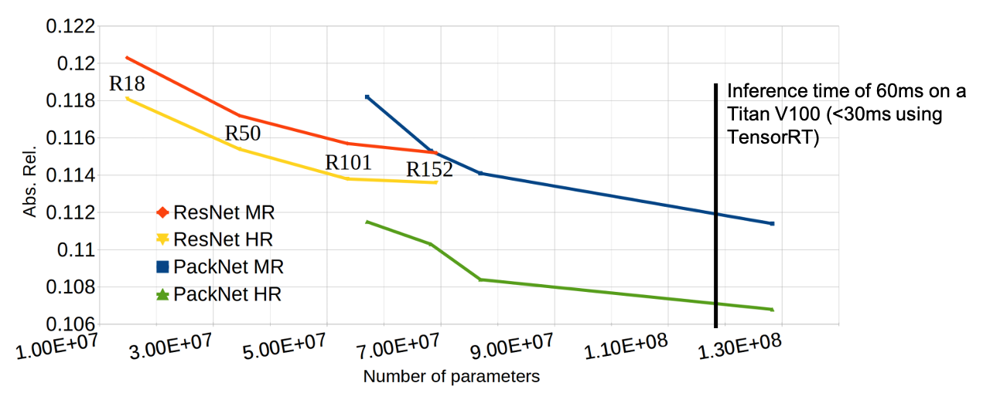

# Paper Summary of "3D Packing for Self-Supervised Monocular Depth Estimation"

In this blog article, I will summarize the Paper [3D Packing for Self-Supervised Monocular Depth Estimation](https://arxiv.org/pdf/1905.02693.pdf) written by Vitor Guizlini, Rareș Ambruș, Sundeep Pillai, Allan Raventos and Adrien Gaidon and published on the Conference for Computer Vision and Pattern Recognition (CVPR) in 2020.  
We briefly take a look at the task at hand, other proposed methods and the approach used in the paper.

## Introduction – What is Depth Estimation?

Depth Estimation deals with the problem of gaining spatial insights for a given environment. This is a crucial task for every program that interacts with their environment. Prominent problems, which depend on some kind of depth estimation include: 

* Robotics and Autonomous Driving, where depth estimation is used to give the robot a perception of its 3D environment to prevent it from crashing into objects or enables it to interact with its environment
* Augmented Reality (AR), where depth estimation is needed to ensure that a virtual object obeys the structure of the scene to make it look natural in its environment
* Various mapping tasks, where depth estimation can be used to create a 3D map of a given environment (for example during an endoscopy [7])

<i style="margin: 0; padding: 0">An example depth map from [1]</i>

### Methods

Depth Estimation can be implemented using various methods. None of which are perfect though and have their advantages and disadvantages:

|Solution|PRO's|CON's|
|---|---|---|
|LiDAR| Very accurate datapoints, no deep learning needed (less computational cost)| Generates sparse pointclouds, very expensive |
|RGB-D| Much cheaper than LiDAR, accurate, no deep learning needed (less computation cost)| Performs poorly outdoors|
|Stereo Depth Estimation|Depth can be estimated deterministically through image disparity| Depends on two cameras|
|Monocular Depth Estimation|Does not depend on stereo camera setup, most compact approach| Monocular Depth cues are very ambiguous [2]|

## Monocular Depth Estimation
At first glance, estimating depth from a monocular camera setup seems to be a bad idea. The authors of a previous paper [2] even describe it as an *"[...] ill-posed problem as there is an extremely large number of possible incorrect depths per pixel [...]"*. This is due to the fact that monocular depth estimation is a very ambiguous task, where depth cues can be misinterpreted, leading to wrong depth estimations. Scenes containing a television (or huge advertisements) could thereby suffer from wrong depth estimations due to monocular depth cues being displayed inside of the screen. 
But on the other hand, sometimes a stereo camera setup is just not viable due to space constraints or maybe because we want to infer depth from an image that has already been taken without a second image from a different position.

### Supervised Approaches
The first instinct to tackle a problem like this is framing it as a supervised regression problem, where we use ground truth data (for example from LiDAR Sensors) to calculate a pixelwise loss for a estimated depth map. In this case, calculating the loss is very straight forward since the estimated depth map just has to be compared to its ground truth counterpart.

Eigen et al. proposed in [3] such an approach, where a multi-scale network was trained on data from RGB-D cameras and the KITTI dataset, which contains image sequences with ground-truth data from LiDAR Sensor. A later paper (DORN) [6], written by Fu et al., proposed to predict a discrete depth map instead of one with continuous depth values, which improved the results of supervised approaches.

One joint problem of supervised approach still remained though: Gathering labelled training data is a challenge by itself, since LiDAR measurement are not as popular as simple video recordings or image sequences. 

### Unsupervised Approaches
Instead of using ground truth data at training time, we can also use unsupervised methods to train a depth estimator and thereby avoid the use of ground truth labelled data entirely. While solving the problem of limited training data, another serious question arises:  
How do we train such a depth estimator without having depth measurements to compare it to?

There are two main approaches to Unsupervised Monocular Depth Estimation, which can be identified by their training process and the way they calculate the overall loss.

#### Training using Stereopsis

As mentioned earlier, a stereo camera depth estimator is more or less a deterministically solvable problem. This is due to the fact that we can estimate depth by comparing the image disparity between different objects in the left and the right image: The greater the disparity of an object between the two images, the shorter is the distance between the two cameras and the object.

<i style="margin: 0; padding: 0">Image disparity visualized </i>

Godard et al. [4] leverage this principle to construct their loss function. They use a stereo camera setup at training time, where images are concurrently taken from each camera, thereby generating pairs of images respectively containing one image from the left camera and one from the right.  
Using one image as input (for example the left image) a pixelwise disparity map is generated which, combined with the input image, can be used to reconstruct the other image (in this example the right image). By comparing this reconstructed image with its actual counterpart a loss can be calculated.

<i style="margin: 0; padding: 0">Training Pipeline proposed by Gogard et al. in [4]</i>

This loss calculation is pretty interesting, but it still uses two cameras at training time and the loss function is based on a binocular depth cue: stereopsis (or image disparity).  
One might think that a monocular depth estimator should also be trained on monocular depth cues. This is what the next proposed loss function does.

#### Training using Structure from Motion
Since the loss function proposed by Godard et al. in [4] rely on a binocular setup at training time, a new loss function was needed to realize training in a monocular setting and to calculate a loss based solely on moncular cues. Instead of image disparity, the concept of motion parallax plays a crucial role in training the depth estimator.  
In a sequence of images where the camera is in motion, objects depicted in the image sequence seem to move as well due to the relative velocity between object and camera. The magnitude of this movement decreases though as the distance between object and camera increases. This is called motion parallax.

<i style="margin: 0; padding: 0">Motion Parallax Phenomenon.  Source: Wikipedia</i>

To leverage the structure from motion depth-cue Zhou et al. proposed in [5] to concurrently train a depth estimator and a pose estimator on a sequence of images, to not only estimate depth, but to also estimate the camera movement between frames.  
While the depth estimator outputs a depth map using a target image as input, the pose estimator uses two sequential images (one of them being the target image) as input to estimate a matrix that describes the ego-motion in all 6 degrees of freedom (forwards/backwards, right/left, up/down, pitch, roll and yaw). 

Combining these two outputs and the second input image to the pose-network (not the target image), the target image can be reconstructed which can, similar to the previous unsupervised approach, be used to calculate a loss by comparing the actual target image with the reconstructed one. This process can be repeated for a variable number of images in the sequence. This results in one reconstructed target image for each context image (images in the sequence, which are not the target image). The loss can then be determined by considering every reconstruction of the target image.

To account for *natural* error, such as pixel occlusions due to motion between frames, Godard et. al proposed in [2] to use the minimum loss per pixel over all reconstructed images. This means that, if an object is occluded by another object in one context image (resulting in a high error in that region) but not in another context image. The lower loss should be used to prevent corrections in the network which might be counterproductive.

<i style="margin: 0; padding: 0">Training Pipeline proposed by Godard et al. in the Monodepth2 paper [2]</i>

Unsupervised monocular depth estimation still struggles with two problems though: 
* **Infinite Depth**: Training using Structure from Motion depends on a relative velocity between the observer (the camera) and the observing objects. If an object and the observer move at a similar or even the same speed, the object will occupy the same pixels over the observed image sequence. Looking back at the concept of motion parallax, we know that object that are further away move less in comparison to objects closer to the observer. Thereby, if an object does not move at all it must be infinitely far away. To accomodate this issue, a binary mask can be implemented, which ignores every object at training time, that does occupy the same pixel over the image sequence.
* **Scale Ambiguity**: All unsupervised loss functions are agnostic to a measurement of distance (for example: the metric system), which is why a metrically accurate distance between an object and the observer can not be inferred. Supervised approaches do not suffer from this problem, since they are scaled at training time using their ground truth training data with metrically accurate labels. To overcome this problem unsupervised approaches usually have to be scaled at test time using ground truth labeled data.

<i style="margin: 0; padding: 0">Infinite Depth Problem   Source: https://ai.googleblog.com/2018/11/a-structured-approach-to-unsupervised.html</i>

## Contributions of the Paper
The paper builds on top of previous works in unsupervised monocular depth estimation using structure from motion. By replacing the previous used network architecture for the depth estimator, the authors expect less information loss during the feature encoding and decoding stages of the network. By introducting weak velocity supervision at training time, the authors additionally aim to solve the problem of scale ambiguity for unsupervised monocular depth estimation using the structure from motion approach.

### PackNet Architecture
The model architecture used in previous approaches (a U-Net architecture) was initially intended for image segmentation tasks, which do not depend on encoding spatial information as much as tasks like depth estimation. This is why the authors of this paper proposed a novel network architecture which use packing and unpacking blocks to respectively replace the encoding and decoding stages of the U-Net architecture. The authors claim that using these blocks, the network can more efficiently compress spatial features, which result in less information loss, allowing the network to almost perfectly reproduce input images.

<i style="margin: 0; padding: 0">Proposed Packing/Unpacking Blocks from [1]</i>

### Velocity based loss function
Velocity sensors are ubiqutous in the field of robotics. Even phones have some kind of inertia measurement unit (IMU) on board. These velocity measurements can be leveraged at training time to solve a crucial problem of unsupervised monocular depth estimation: scale ambiguity.  
By comparing the magnitude of the pose estimation network output matrix to the given velocity and the elapsed time between the two input frames, a metric scale can be introduced to the pose network. Because of the global photometric loss, which depends on the pose matrix, this scale awareness also propagates to the depth estimation network.

<i style="margin: 0; padding: 0">Velocity loss function proposed in [1]</i>

## Experiments and Discussion

To put the perfomance of the proposed methods into perspective, the authors conducted a number of experiments. A few of which I would like to present in the following paragraphs.

### Quantitative Evaluation

The authors compared different methods of monocular depth estimation using different image resolutions, levels of supervision (D = supervised training, M = trained using monocular images, M+v unsupervised with velocity data at training time but without ground truth scaling at test time) and combinations of datasets (K = KITTI Dataset, CS+K = Pretraining on CityScapes Dataset and finetuning on KITTI Dataset). This kind of analysis enables an objective evaluation of the methods perfomance. Questions that might be answered are: 
* Does it beat the previous state of the art in unsupervised moncoular depth estimation? 
* How does the velocity supervision impact the performance? Can it compete with models that are scaled on ground truth data?
* How does the method compare to supervised approaches?

To simplify the table, I've cropped out the most interesting rows. Metrics are marked with an arrow (down = lower is better, up = higher is better):

These results show that not only the novel architecture but also the scale aware approach using weak velocity supervision at training time improves on the previous state of the art [2]. Although velocity supervision is not as accurate as ground truth scaling it still generates surprisingly good results. One thing to keep in mind is that unlike any other unsupervised network, networks trained using the novel velocity loss function, never see any ground truth data. The metric accuracy is only inferred by introducing the velocity data at training time.
Addionally, we can also see that the PackNet architecture generates results competitive to supervised models.

### Qualitative Evaluation

The authors also conducted a qualitative evaluation, by comparing different depth maps from the PackNet architecture, Monodepth2 [2] (the previous state of the art in unsupervised monocular depth estimation) and DORN (a supervised approach). 

PackNet subjectively outperforms both Monodepth2 and DORN. One interesting obeservation one can make is that DORN performs poorly at the top half of the image and also has a lot more artifacts than the unsupersived approaches. This might be due to the fact that the used ground truth data often consists of a very sparse point clouds instead of continuous depth maps, which naturally decreases the perfomance of thin and small objects (for Example: poles or traffic signs). Bad performances for the sky in DORN could also be due to limitations of ground truth data. LiDAR, often used to generate training data, cannot generate **any** points in the sky due to range limitations. Thereby the sky, or objects very far away often times become not trainable by supervised approaches relying on LiDAR data.

### Evaluation of Model Scalability
The last very interesting experiment, which I want to display, deals with how the model performs with different numbers of trainanble parameters and input resolution.

This experiment shows three very interesting things:
1. The PackNet model architecture is able to leverage higher input resolutions way better than ResNet architectures. This supports the authors claim, that PackNet is better at preserving important spatial information.
2. PackNet flattens out much later in term of model size (number of trainable parameters)
3. The measured inference time is < 60ms in quite large implementations of the PackNet model. The authors infer that the model is thereby able to run in realtime. One thing to keep in mind here is that the used GPU is very powerful. It would be nice to compare the inference time on a low end GPU.

## Conclusion
The paper proposes serious improvements on top of previous work. By introducing a novel loss function that leverages ubiqutous velocity measurements a crucial problem of unsupervised monocular depth estimation is solved. Additionally, due to the new network architecture which is able to better leverage high resolution data, the proposed method is able to outperform the previous state of the art, producing finer details in the generated depth maps and decreasing the performance gap between supervised and unsupervised approaches.

## References
[1] Vitor Guizlini, Rareș Ambruș, Sundeep Pillai, Allan Raventos and Adrien Gaidon. *3D Packing for Self-Supervised Monocular Depth Estimation.* In CVPR, 2020.

[2] Clement Godard, Oisin Mac Aodha, Michael Firman, and Gabriel J. Brostow. *Digging into self-supervised monocular depth prediction.* In ICCV, 2019.

[3] David Eigen, Christian Puhrsch, and Rob Fergus. *Depth map prediction from a single image using a multi-scale deep network.* Advances in neural information processing systems, 2014.

[4] Clement Godard, Oisin Mac Aodha, and Gabriel J Brostow. *Unsupervised monocular depth estimation with leftright consistency.* In CVPR, 2017.

[5] Tinghui Zhou, Matthew Brown, Noah Snavely, and David G Lowe. *Unsupervised learning of depth and ego-motion from video. Advances in neural information processing systems*. In CVPR, 2014.

[6] Huan Fu, Mingming Gong, Chaohui Wang, Kayhan Batmanghelich, and Dacheng Tao. *Deep ordinal regression network for monocular depth estimation.* Proceedings of the IEEE Conference on Computer Vision and Pattern Recognition, 2018.

[7] David Recasens *Endo Depth and Motion (https://davidrecasens.github.io/EndoDepthAndMotion/#download-dataset)*
