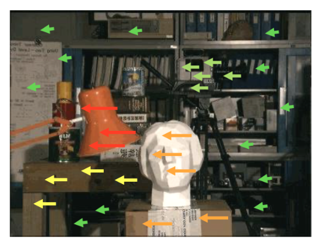
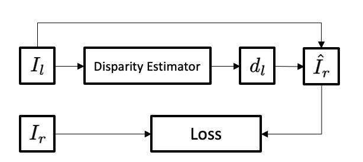

# 3D Packing for Self-Supervised Monocular Depth Estimation (change title)

In this blog article, I will summarize the Paper [3D Packing for Self-Supervised Monocular Depth Estimation](https://arxiv.org/pdf/1905.02693.pdf) written by Vitor Guizlini, Rareș Ambruș, Sundeep Pillai, Allan Raventos and Adrien Gaidon and published on the Conference for Computer Vision and Pattern Recognition (CVPR) in 2020.  
We briefly take a look at the task at hand, other proposed methods and the approach used in the paper, which uses a single camera setup.

## Introduction – What is Depth Estimation?

//TODO
Similar to humans, or animals in general, objects that actively interact with their environment need some kind of perception of it. While tasks like image segmentation are very successful segmenting different kinds of objects in a given image, they do not take the 3D structure into account. But this perception of depth is crucial for everyday interactions with our environment. Just image going up a staircase: Just differentiating the stairs from each other is not enough to master this obstacle unharmed – we need to be aware of the 3D structure of this given staircase (i.E.: distance between stair steps, height of stair steps, etc.) to make sure we don't stumble over a single stair step.  
This is where the task of Depth Estimation comes in: Using sensory input (for example cameras or LiDAR), we can estimate a depth map, which estimates the depth (or the distance) of an object to the observing sensor.  

Depth Estimation is used for a number of 

Applicationss
Depth Estimation is the task of gaining insights about the spatial and 3-dimesional structure of a given environment. 
This is useful for a lot of applications including: 
* Robotics, where depth estimation is used to give the robot a perception of its 3D environment to prevent it from crashing into objects
* Augmented Reality (AR), where depth estimation is needed to ensure that a virtual object obeys the structure of the scene to make the projected object look natural

### Methods

|Solution|PRO's|CON's|
|---|---|---|
|LiDAR| Very accurate datapoints, no deep learning needed (less computational cost)| Generates sparse pointclouds, very expensive  |
|RGB-D| Cheap, accurate, no deep learning needed (less computation cost)| Performs poorly outdoors  |
|Stereo Depth Estimation| | |
|Monocular Depth Estimation||Inherently ill posed problem [x]|

## Monocular Depth Estimation
At first glance, estimating depth from a monocular camera setup seems to be a bad idea. The authors of a previous paper [2] even describe it as an ill-posed problem without a second image to triangulate objects using image disparity. This is due to the fact that monocular depth estimation is a very ambiguous task, where a single image can  

But on the other hand, sometimes a stereo camera setup is just not viable due to space constraints or maybe because we want to infer depth from an image that has already been taken without a second image from a different position or any attached depth data.

### Supervised Approaches
The first instinct to tackle a problem like this is framing it as a supervised regression problem, where we use ground truth data to calculate a pixelwise loss for a estimated depth map. 

* 

==> Acquiring ground truth data is a difficult task itself

### Unsupervised Approaches
Instead of using ground truth data at training time, we can also use unsupervised methods to train a depth estimator and thereby avoid the use of ground truth labelled data entirely. While solving the problem of limited training data, another serious question arises:  
How do we train such a depth estimator without having depth measurements to compare it to?

There are two main approaches to Unsupervised Monocular Depth Estimation, which can be identified by their training process and the way they calculate the overall loss.

#### XXX

As mentioned earlier, a stereo camera depth estimator is more or less a deterministically solvable problem. This is due to the fact that we can estimate depth by comparing the image disparity between different objects in the left and the right image: The greater the disparity of an object between the two images, the shorter is the distance between the two cameras and the object.

Godard et al. [3] leverage this principle to construct their loss function. They use a stereo camera setup at training time, where images are concurrently taken from each camera, thereby generating pairs of images respectively containing one image from the left camera and one from the right.  
Using one image as input (for example the left image) a pixelwise disparity map is generated which, combined with the input image, can be used to reconstruct the other image (in this exmaple the right image). By comparing this reconstructed image with its actual counterpart a loss can be calculated.

This Loss calculation is pretty interesting, but it still uses

* Stereo camera supervision as first approach
* Structure from Motion approach (Concurrently training Pose network and depth estimator)
* Two Problems of Unsupervised MDE: (Infinite Depth and Scale Ambiguity)

## Contributions of the Paper
So how does this paper improve on top of previous methods?

## Analysis

## Conclusion

## References
[1] Vitor Guizlini, Rareș Ambruș, Sundeep Pillai, Allan Raventos and Adrien Gaidon. *3D Packing for Self-Supervised Monocular Depth Estimation.* In CVPR, 2020.

[2] Clement Godard, Oisin Mac Aodha, Michael Firman, and Gabriel J. Brostow. *Digging into self-supervised monocular depth prediction.* In ICCV, 2019.

[3] Left-Right Consistency